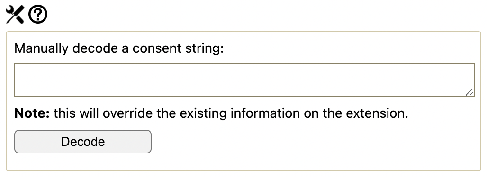
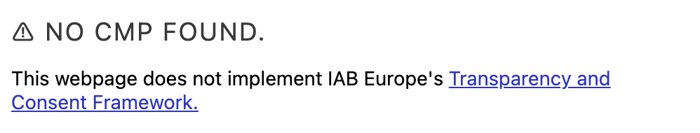
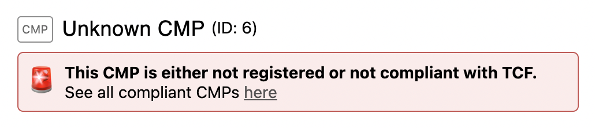

# Cookie Glasses
CookieGlasses is a browser extension that displays information registered by cookie banners implemented according to the IAB's [Transparency &amp; Consent Framework (TCF)](https://iabeurope.eu/transparency-consent-framework/).

## Introduction

In the paper [Do Cookie Banners Respect my Choice? Measuring Legal Compliance of Banners from IAB Europe's Transparency and Consent Framework](https://arxiv.org/abs/1911.09964), it is shown that Consent Management Providers (CMPs) of IAB Europe's Transparency & Consent Framework (TCF) do not always respect user's choice. This extension allows you to verify that your consent is stored appropriately.

This extension for Firefox and Chrome queries CMPs of IAB Europe's TCF in the same position as a third-party advertiser, making it possible to see consent set by CMPs in real time. In other words, you can see whether consent registered by cookie banners is actually the consent you gave.
This extension only works with cookie banners of [IAB Europe's TCF](https://iabeurope.eu/transparency-consent-framework/).


The extension obtains its information via the TCF Consent String (TCString), obtained from [IAB's public API's](https://github.com/InteractiveAdvertisingBureau/GDPR-Transparency-and-Consent-Framework/blob/master/TCFv2/IAB%20Tech%20Lab%20-%20CMP%20API%20v2.md).

Author: Célestin Matte (Université Côte d'Azur, Inria, France)
Contributors: Katie Ta, Charles Tan (Providence, RI, USA)

## Features

Based on the TC string from the CMP, we decode and show the following information on the browser extension
- The TCF data processing purposes you've consented to and the purposes that are allowed based on legitimate interests
- List of all the vendors who are allowed to process your data and a list of the data processing purposes and features for each vendor
- Several aggregate values including the number of active and inactive vendors (inactive means they are allowed to process your data but you've rejected all of the purposes for which they would process your data)


Other features:
- Functionality to manually decode a so-called "consent string" of the framework
- Communicates if the current webpage does not implement the TCF




#### Update the CMP list

Run the `fetch_cmp_list.py` script to update the CMP list. This script scrapes https://iabeurope.eu/cmp-list/ to get the most up-to-date CMP list information. According to the website, the list can change daily but in practice, we've observed it changes less frequently.

It's important to refetch the CMP list, since the list on IAB's website reflects all CMP's that are currently registered _and_ compliant with the TCF.

`python3 Cookie-Glasses/src/scripts/fetch_cmp_list.py`

It's important to make sure our CMP list is up to date to ensure that Cookie Glasses shows the correct CMP information to the user. The information at https://iabeurope.eu/cmp-list/ shows all the CMPs who have been approved by the IAB, and occassionally CMPs are added or removed from the list. If a website uses a CMP that is not included in that list, then the CMP has not been approved by the IAB and users should be wary of how vendors are processing the user's data. Below is the message shown when the CMP a website uses is not in the list.



## Install

You can either install the extension from browsers' addon stores (simple, easy), or manually install it from source.

### Install from addon store

Chrome / Chromium : https://chrome.google.com/webstore/detail/cookie-glasses/gncnjghkclkhpkfhghcbobednpchjifk


Warning! CookieGlasses for TCFv2 on Firefox has not been extensively tested

Firefox: https://addons.mozilla.org/fr/firefox/addon/cookie-glasses/

### Manual install from source:

The extension has been tested on Chromium.

#### Chrome / Chromium

1. Download the ZIP file of Cookie Glasses on your computer.

2. Unzip the ZIP file you just downloaded on your computer.
3. Open Chrome and enter the following URL in your tab bar: chrome://extensions/
4. Enable Developer mode in the top right.
5. Click "Load unpacked"
6. Choose the `Cookie-Glasse-master` folder on your computer.
7. Visit websites implementing the Transparency & Consent Framework
8. Enjoy detecting violations!

#### Firefox

Warning! CookieGlasses for TCFv2 on Firefox has not been extensively tested

On Firefox, out-of-store addons can only be loaded for the duration of the session (you will have to redo these steps if you close your browser).

1. Download the ZIP file of Cookie Glasses on your computer.

2. Unzip the ZIP file you just downloaded on your computer.
3. Open Firefox and enter the following URL in your tab bar: about:debugging#/runtime/this-firefox
4. Click "Load temporary addon"
5. Choose the `manifest.json` file in the `Cookie-Glasse-master` folder on your computer.
6. Visit websites implementing the Transparency & Consent Framework
7. Enjoy detecting violations!

## Limitations

As explained in the paper, there are two ways for advertisers to query the CMP:
1. through a direct call to the __tcfapi() function if they are in a first-party position,
2. through a postMessage sent to the __tcfapiLocator (formerly known as __cmpLocator in v1) iframe if they are in a third-party position.

Because of the security mechanisms of browsers extensions, Cookie Glasses can only use the second method. According to our measurement, this method is working on 79% of websites using the TCF.

If you want to see consent on the remaining 21% of websites, here's a manual workaround:
1. Open the developer console (ctrl+maj+i)
2. Run the following snippet in the console of the webpage in question: 
```__tcfapi("getTCData", 2, function(v, success) { console.log(v); });```
3. If you obtain a response, copy the string in the "tcString" field and decode it in the "Manually decode Consent String" section of the extension. You can find this section by clicking on the Tool icon at the bottom of the extension.

For now, the extension does not display the global shared cookie (which is a cookie storing consent, readable and writable by all CMPs of the framework).

## Privacy Policy
Cookie Glasses does not handle any personal information.
Cookie Glasses only processes consent information from IAB Europe's Transparency and Consent Framework (TCF) locally, and does not send any information to a distant server.
